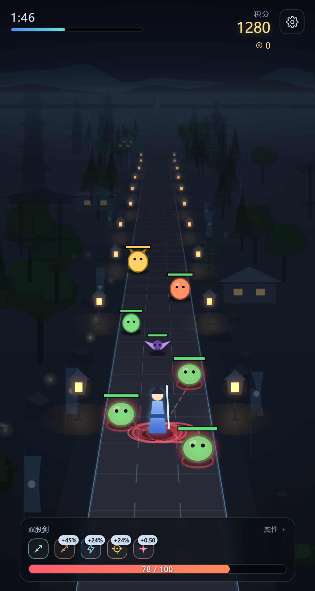
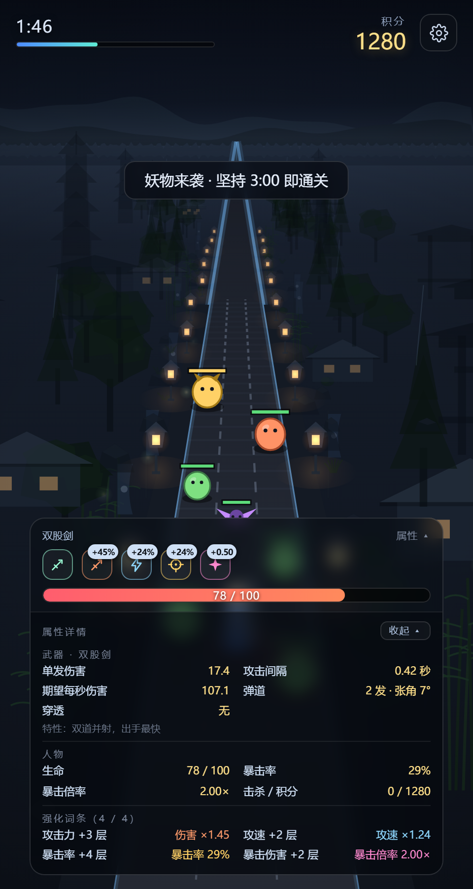

# 御剑封路 · Road Defender

固定视角、三路出怪、伪 3D 渲染的躲避射击小游戏。**零依赖、零构建**——三个文件，双击就能玩。

目标只有一个：**撑满 180 秒**。妖物会主动向你扑击，你能做的只有左右挪步和还手。

> **▶ 在线试玩：<https://ltwza.github.io/road-defender/>**
>
> 手机建议竖屏打开。分享到微信时若链接卡片没有缩略图，是抓取器还没缓存，过几分钟再发一次即可。

<p align="center">
  
  
</p>

---

## 玩法

| | |
|---|---|
| **移动** | 按住屏幕**左右拖动**（鼠标拖动 / `A` `D` / `←` `→` 同样可以） |
| **攻击** | 自动开火，你只管走位 |
| **通关** | 存活 180 秒 |
| **成长** | 击杀掉落武器与词条，走过去捡 |

### 操作的关键设计

移动是**增量式拖动**：手指横移 1px，人物在屏幕上就横移 1px，松手即停。

不是"点哪里就走到哪里"——那种做法要先算出目标点再让角色每帧插值过去，凭空多出约 60ms 滞后，手感是"被拖着走"；而且路只有 4 米宽，手指轻点一下就横移大半条路，想微调半米根本做不到，妖物扑过来时也刹不住。

### 妖物

四类，都会在接近时**蓄力 → 扑击**（扑击前地面有红色预警圈，看到就得让开）：

| 妖物 | 特点 |
|---|---|
| 小妖 | 最基础，慢速直线推进 |
| 飞蝠 | 高速、血薄、杀伤低 |
| 蛮兵 | 血厚、慢、单次伤害高 |
| 妖将 | 精英，出现得晚，血极厚 |

### 武器

初始是**飞剑**。击杀掉落的武器会**替换**当前武器（不可叠加）：

| 武器 | 特性 | 单发伤害 | 齐射展宽 |
|---|---|---|---|
| 飞剑 | 单发直线，稳而沉 | 13 | — |
| 双股剑 | 双道并射，出手最快 | 9 ×2 | 0.9 米 |
| 三才剑阵 | 三发齐出，火力最密 | 8 ×3 | 1.0 米 |
| 穿云剑 | 单发最重，一贯三 | 40（穿透 3） | — |

> **齐射展宽** = 各发在*目标所在深度*上并排散开的总宽度（米），不是角度。按"米"定义，近处会自动收束、远处也不会失控散发。三发齐射展宽 1.0 米，最外侧那一发离目标中心 0.5 米，仍在妖物判定半径（最小 0.66 米，飞蝠）之内 —— 所以齐射能全部命中同一个目标，而不是三发只中一发。
>
> 多发武器的**单发伤害**（9 / 8）比初始飞剑（13）低，这是刻意的：齐射能全中之后，多发武器的实际 dps 是 34.6 / 35.3，单发伤害若还写 12 就会到 46 / 53 —— 高过「小妖血量 20 ÷ 预警 0.5 秒 = 40」这条线，妖物会在扑到之前被打死，站着不动反而无敌（实测站桩通关率会从 8% 飙到 42%）。

### 词条（可叠加）

同名词条会**累计层数**，图标右上角直接写累计后的数值（`+45%` 比 `+3` 直观）。

| 词条 | 每层 | 基础值 |
|---|---|---|
| 攻击力 | 伤害 +15% | ×1.00 |
| 攻速 | 攻速 +12% | ×1.00 |
| 暴击率 | +6% | 5%（上限 92%） |
| 暴击伤害 | +0.25 | 1.50× |

### HUD

血条底部居中。血条左上角是词条图标行，**宽度等于血条宽度**，词条多了会**往上换行**（从左往右、从下往上），所以血条永远不会被图标挤走。点一下信息条展开完整属性面板，再点一下收起。

---

## 运行

不需要 `npm install`，不需要打包：

```bash
# 直接双击 index.html，或者起个静态服务器：
python -m http.server 8000
# 然后打开 http://localhost:8000
```

> **建议用竖屏、手机或竖长窗口玩。** 道路与 HUD 都按屏幕尺寸等比布局，但竖屏才是设计视角。

---

## 目录结构

```
road-defender/
├── index.html      页面结构 + HUD 样式
├── game.js         全部游戏逻辑（配置、状态机、渲染、输入、HUD）
├── projector.js    RoadProjector —— 伪 3D 投影器（独立、可复用）
└── dev/            开发与验证脚本
    ├── e2e-test.js     端到端逻辑验证（jsdom 跑真实帧循环）
    ├── balance-test.js 数值平衡护栏（几何/时序/出怪曲线/dps）
    ├── stand180.js     整局站桩陪跑：验证"站着不动会输"
    ├── diag.js         带 233ms 反应延迟的自动玩家：验证"这游戏能通关"
    ├── ledger.js       逐帧漏怪台账
    ├── curbdiag.js     路沿诊断：量"远处的路沿到底多粗多亮"
    └── shot.js         Chrome CDP 实机截图 / 性能采样（--game= 可拍同构图对照）
```

---

## 技术要点

### 伪 3D 投影（`projector.js`）

人物永远站在深度 `y = 22` 米处（屏幕下方固定位置），世界以 12 米/秒向后流动——"人不动、路在退"，于是得到第三人称追尾的固定视角。

投影用最常见的透视除法：`t = y / (y + k)`，屏幕位置在近端与消失点之间按 `t` 插值，缩放系数取 `1 − t`。**路面、妖物、掉落物、两侧景物全都走同一个投影器**，所以深度关系天然一致——树不会浮在路上，灯笼不会陷进地里。

### 输入：Pointer Events 优先，触摸兜底

`pointerdown` 要 Chrome 55 / iOS 13 才有。安卓微信内置浏览器的旧 X5 内核是 Chromium 53，那个环境里 `pointer*` 一个都不派发——而画布上已经声明了 `touch-action: none`，症状就是**画面正常渲染、人物纹丝不动、属性面板也点不开**，看起来像游戏坏了。

所以输入层做了一层事件源抽象：有 `PointerEvent` 就只挂 `pointer*`；没有就额外挂一套 `touch*`，把 `Touch` 包装成 `{clientX, clientY}` 的形状。**两条路共用同一套拖动账本**，行为完全一致，也不会双触发（否则一次触摸会被处理两遍，位移直接翻倍）。

### 场景装饰

道路两侧铺了三条景带（贴路带 / 中景带 / 远景带）、石灯笼、萤火与两层视差远山。景物位置由**世界里程**即时推导、不保存状态，因此可以随时枚举——测试能直接清点"当前视野里有哪些物件"，而不必去解码像素。雾用指数衰减 `alpha = fogMin + (1 − fogMin) · e^(−y/fogD)`，灯笼单独用更小的衰减系数，于是能"穿雾"当路标。

### 宽度是米，不是像素（路沿）


路沿（路两侧那条发光的边条）一开始是 `ctx.lineWidth = 3`、从近端一路描到消失点。近处看着没问题，但**路宽是按 `1 − t` 收缩到 0 的，而线宽是固定的屏幕像素**——于是「路沿宽 ÷ 路宽」这个比值随距离失控：

| 深度 | 22 m | 100 m | 193 m | 306 m | 414 m |
|---|---|---|---|---|---|
| 改前 路沿/路宽 | 1.2 % | 2.5 % | 10.1 % | 11.8 % | **23.1 %** |
| 改前 明暗差 | 62 | 78 | 80 | 82 | 80 |

屏幕上就是**远处的路沿比整条路还宽**；而 alpha 恒定 0.5，远处路面已经暗到 `rgb(31,32,36)` 路沿却照旧，明暗差反而从 62 涨到 80 个亮度级——所以还"又亮"。

修法是把宽度从**屏幕量**换成**世界量**：`w = 0.048 米 × pxPerMeter × (1 − t)`。于是比值恒等于 `wM / roadWidth = 1.2%`，**与深度无关，也与屏幕宽度无关**；明度则走景物同一套空气透视 `exp(−depth/110)`，260 米开外自然淡出——不是被截断，是收缩到看不见。

注意别把这件事推成"所有线宽都得缩放"：路面那些**横向**流动条纹用固定像素并没有问题，因为一条横线的视觉厚度本来就不由透视决定。这个坑只属于**沿深度延伸**的线。

### 验证而不是感觉

这几个脚本各管一件事，全部可重复运行：

```bash
export NODE_PATH=<你的 node_modules 路径>          # 需要 jsdom
node dev/e2e-test.js        # 169 项断言，含 UI 契约、拖动 1:1、齐射弹道、移动端视口、路沿透视
node dev/balance-test.js    # 27 项数值护栏
node dev/stand180.js        # 站桩 12 局：应当基本全败（威胁是真实的）
node dev/diag.js            # 233ms 反应延迟的自动玩家：应当能通关（难度不是不可能的）
node dev/aimdiag.js         # 弹道诊断：各武器的命中发数与真实命中/发射比
node dev/spreaddiag.js      # 散布口径：固定角度 vs 固定米数，跑真实投影器算屏幕偏移
node dev/curbdiag.js before # 路沿诊断：逐行扫描量宽度比值与明暗差随距离的变化
node dev/shot.js xxx --dpr=2 --perf   # 实机截图 + 渲染耗时
```

`dev/touchscroll.js` 单独说：它用**真实 Chrome + 合成触摸事件**测"手机上属性面板能不能滚"。
jsdom 不做布局、不走真实输入管线，`touch-action` 和浏览器默认滚动**在 jsdom 里永远测不出来**；
鼠标滚轮也不是同一条链路，所以这类问题只能在带触摸模拟的真机环境里复现：

```bash
node dev/touchscroll.js --stuff=8            # 塞 8 个词条把面板撑到溢出，再测手指能不能滚
node dev/touchscroll.js --visual=704 --h=844  # 劫持 visualViewport，制造"大视口 vs 真实可视区"错位
```

其中几条断言值得单独说，因为它们钉的都是**看不出症状、但会真出事**的东西：

- 拖动必须是 1:1：手指 +80px，人物屏幕位移必须也是 80±3px。
- 信息条上按下后横挪超过 7px 必须判定为"拖动"而不是"点击"——否则玩家拇指压在血条上就动不了。
- 图标行必须是 `flex-wrap: wrap-reverse` 且**不许设 width**——一旦写错，症状是"新词条从下面把血条顶出屏幕"，肉眼第一眼很难发现。
- 属性面板里的数字必须与开火时实际用的那份完全一致（同一个 `playerStats()`），杜绝"说明与实现不一致"。
- **`#app` 不许用裸 `100vh`**：移动浏览器的 `100vh` 是"大视口"（地址栏收起时的高度），
  比真实可视区高 100~140px，会让底部 HUD 整块锚到屏幕外——而且面板的 `max-height` 也按大视口算，
  于是它并不溢出、**怎么拉都拉不动**，看着像面板坏了。电脑上没有地址栏，所以这个症状只在手机上出现。
  统一走 `--vh-full`（`dvh` + 老内核由 `visualViewport` 兜底），底部再让出 `safe-area-inset-bottom`。
- 齐射必须**全部命中**：把一只钉死位置的靶子放在 8~60 米的六个距离上（正前方与侧路各测一遍），开一枪数实际命中发数——双股剑必须 2/2、三才剑阵必须 3/3。这条是补的：散布曾经按"固定夹角"定义，0.20 弧度在 17 米处横向偏 3.45 米、而妖物判定半径只有 0.76 米，导致双股剑 17 米外两发全空、三才剑阵永远只中一发，实战命中率 62% / 47%，比初始飞剑还弱。
- 路沿宽度必须**随透视收缩**：「路沿宽 ÷ 路宽」全程极差 < 2%，且宽度与透明度沿深度单调不增。
  它同时钉住两件事——"别用固定像素"，以及"**别用截断冒充收缩**"：把路沿在 10 米处一砍，
  比值同样是恒定的，但那是把问题藏起来而不是修好，所以另有一条"末端深度必须 > 150 米"。
  判据取 `RD.curbSegments()` 的解析值而不是解像素：alpha 一低，像素扫描就报"看不见"，
  它只能证明"远处确实淡出了"，证明不了比值恒定——而比值失控恰恰是这次的病根。

---

## 授权

MIT
