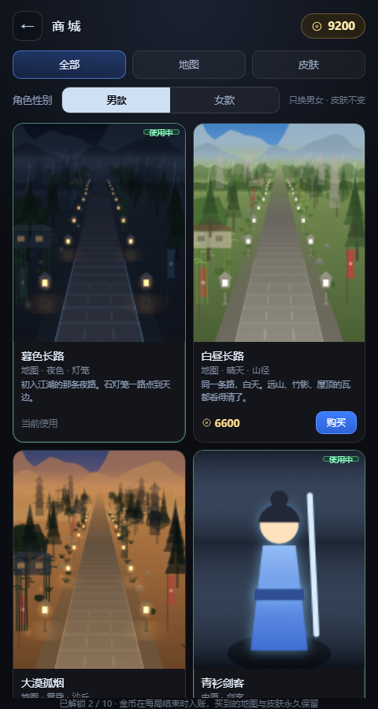
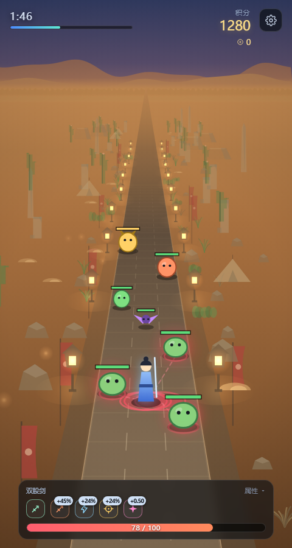
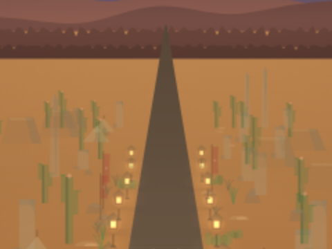
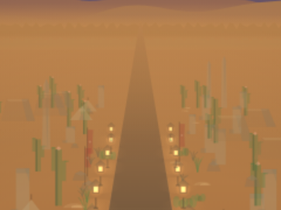

# 御剑封路 · Road Defender

固定视角、三路出怪、伪 3D 渲染的躲避射击小游戏。**零依赖、零构建**——三个文件，双击就能玩。

目标只有一个：**撑满 180 秒**。妖物会主动向你扑击，你能做的只有左右挪步和还手。

> **▶ 在线试玩：<https://ltwza.github.io/road-defender/>**
>
> 手机建议竖屏打开。分享到微信时若链接卡片没有缩略图，是抓取器还没缓存，过几分钟再发一次即可。

<p align="center">
  
  
</p>
<p align="center">
  
  
</p>

---

## 玩法

| | |
|---|---|
| **移动** | 按住屏幕**左右拖动**（鼠标拖动 / `A` `D` / `←` `→` 同样可以） |
| **攻击** | 自动开火，你只管走位 |
| **通关** | 存活 180 秒 |
| **成长** | 击杀掉落武器与词条，走过去捡 |
| **金币** | 击杀直接掉金币，每局结束（或中途退出）自动入账，攒着去**商城**买地图与皮肤 |

### 操作的关键设计

移动是**增量式拖动**：手指横移 1px，人物在屏幕上就横移 1px，松手即停。

不是"点哪里就走到哪里"——那种做法要先算出目标点再让角色每帧插值过去，凭空多出约 60ms 滞后，手感是"被拖着走"；而且路只有 4 米宽，手指轻点一下就横移大半条路，想微调半米根本做不到，妖物扑过来时也刹不住。

### 妖物

四类，都会在接近时**蓄力 → 扑击**（扑击前地面有红色预警圈，看到就得让开）。金币是**跨局持久**的货币（`coin`），与当局计分的 `score` 是两套口径：后者是"打得好不好"，前者是"值多少钱"。

| 妖物 | 特点 | 积分 | 金币 |
|---|---|---|---|
| 小妖 | 最基础，慢速直线推进 | 10 | 1 |
| 飞蝠 | 高速、血薄、杀伤低 | 16 | 2 |
| 蛮兵 | 血厚、慢、单次伤害高 | 32 | 4 |
| 妖将 | 精英，出现得晚，血极厚 | 70 | 9 |

通关另有 **+120** 金币。这一笔不是奖励数字好看，而是**让"活着"有经济价值**：单局收入若只由"打死多少只"决定，最优解就会变成在路中间硬拼；给了这笔，撑满 3 分钟才是明确的最优策略。120 ≈ 熟练玩家一局掉落的 23%，够重但不至于盖过"打得多"。

### 金币经济（数值从哪来）

价格**不靠感觉定**，先量后定。`dev/economy.js` 用同一套会躲的机器人跑 3 种水平 × 4 个种子共 12 局，量出一局能挣多少：

| 水平 | 掉落 | + 通关奖励 = 到手 |
|---|---|---|
| 熟练（233ms 反应，4/4 通关） | 521 | **641** |
| 一般（400ms 反应） | 227 | 347 |
| 发呆不操作（0/4 通关） | 79 | 79 |

定价**按最快那一档折算**——连最顺的人都要打这么多局，慢的只会更久：

| 商品 | 价格 | 熟练玩家 | 一般玩家 |
|---|---|---|---|
| 暮色长路（夜） | 初始赠送 | — | — |
| 白昼长路 | 6600 | 10.3 局 | 19.0 局 |
| 大漠孤烟 | 8800 | 13.7 局 | 25.4 局 |
| 皮肤 ×6 | 900 ~ 2400 | 1.4 ~ 3.7 局 | 2.6 ~ 6.9 局 |

> 地图刻意比皮肤贵一大档：皮肤是"这一局就想换换看"，地图是"攒一阵子的大件"。`dev/e2e-test.js` 的测试 L 会把上面这组关系钉成断言（改价先跑 `economy.js`，否则测试会拦下来）。

### 商城

**地图**（场景）与**皮肤**两类，顶部可按类型筛选。买下即自动装备，已购与初始款随时可切回。

- **初始的地图/皮肤照列出来，但不售卖**：标签写「初始」而不是「已拥有」，价格位写「初始赠送」，右侧仍是「使用」按钮——必须有这个入口，否则买了新地图之后就再也换不回夜景了。
- **皮肤按"国家 + 职业"分**：中原剑客、希腊重装枪兵、波斯刺客、东瀛浪人、北欧狂战士、埃及祭司、草原弓手。
- **性别切换在皮肤页**（地图页隐藏它，免得让人以为地图也分男女）。切的是同一款皮肤下的**男款/女款**两组参数——肩宽、下摆、发型、裙摆外张，配色与武器不变。所以"换性别"不会换掉你买的皮肤。
- **缩略图不是另画的一套图**：地图卡直接跑 `drawSky/drawBackdrop/drawRoad/drawScenery`，皮肤卡跑 `drawFigure`，靠 `withTarget()` 临时把画布/投影器/主题换成缩略图那一套、画完立刻还原。于是"预览和实机不一致"这件事在结构上就不可能发生。

### 武器

初始是**飞剑**。击杀掉落的武器会**替换**当前武器（不可叠加）：

| 武器 | 特性 | 单发伤害 | 齐射展宽 |
|---|---|---|---|
| 飞剑 | 单发直线，稳而沉 | 13 | — |
| 双股剑 | 双道并射，出手最快 | 9 ×2 | 0.9 米 |
| 三才剑阵 | 三发齐出，火力最密 | 8 ×3 | 1.0 米 |
| 穿云剑 | 单发最重，一贯三 | 40（穿透 3） | — |

> **齐射展宽** = 各发在*目标所在深度*上并排散开的总宽度（米），不是角度。按"米"定义，近处会自动收束、远处也不会失控散发。三发齐射展宽 1.0 米，最外侧那一发离目标中心 0.5 米，仍在妖物判定半径（最小 0.66 米，飞蝠）之内 —— 所以齐射能全部命中同一个目标，而不是三发只中一发。
>
> 多发武器的**单发伤害**（9 / 8）比初始飞剑（13）低，这是刻意的：齐射能全中之后，多发武器的实际 dps 是 34.6 / 35.3，单发伤害若还写 12 就会到 46 / 53 —— 高过「小妖血量 20 ÷ 预警 0.5 秒 = 40」这条线，妖物会在扑到之前被打死，站着不动反而无敌（实测站桩通关率会从 8% 飙到 42%）。

### 词条（可叠加）

同名词条会**累计层数**，图标右上角直接写累计后的数值（`+45%` 比 `+3` 直观）。

| 词条 | 每层 | 基础值 |
|---|---|---|
| 攻击力 | 伤害 +15% | ×1.00 |
| 攻速 | 攻速 +12% | ×1.00 |
| 暴击率 | +6% | 5%（上限 92%） |
| 暴击伤害 | +0.25 | 1.50× |

### HUD

血条底部居中。血条左上角是词条图标行，**宽度等于血条宽度**，词条多了会**往上换行**（从左往右、从下往上），所以血条永远不会被图标挤走。点一下信息条展开完整属性面板，再点一下收起。

右上角是积分与**本局金币**。金币只有真的进账时才会"跳一下"，而且跳的判据是**进账次数**而不是数值——同一帧连捡两只妖物，数值只变一次，但玩家看到的是两次击杀，就该跳两下。金币浮字的颜色和积分的很接近，所以它前面单独加了一枚小金饼，两串数字同时冒出来也分得清哪个是哪个。

金币在每局结束（或中途退出）时自动入账。入账是**幂等**的：结算 → 返回主页 → 再来一局，任何一条路径都会走一次记账，但同一笔钱只会记一次。

---

## 运行

不需要 `npm install`，不需要打包：

```bash
# 直接双击 index.html，或者起个静态服务器：
python -m http.server 8000
# 然后打开 http://localhost:8000
```

> **建议用竖屏、手机或竖长窗口玩。** 道路与 HUD 都按屏幕尺寸等比布局，但竖屏才是设计视角。

---

## 目录结构

```
road-defender/
├── index.html      页面结构 + HUD / 商城样式
├── game.js         全部游戏逻辑（配置、状态机、渲染、输入、HUD、主题与存档）
├── projector.js    RoadProjector —— 伪 3D 投影器（独立、可复用）
└── dev/            开发与验证脚本
    ├── e2e-test.js     端到端逻辑验证（jsdom 跑真实帧循环）
    ├── balance-test.js 数值平衡护栏（几何/时序/出怪曲线/dps）
    ├── economy.js      金币经济基线：量"一局能挣多少"，再拿它校验 MAPS/SKINS 的定价
    ├── stand180.js     整局站桩陪跑：验证"站着不动会输"
    ├── diag.js         带 233ms 反应延迟的自动玩家：验证"这游戏能通关"
    ├── ledger.js       逐帧漏怪台账
    ├── curbdiag.js     路沿诊断：量"远处的路沿到底多粗多亮"
    ├── persp.js        透视剖面：沿深度量"路面从地面里凸出来多少"（--noscenery 取纯背景）
    └── shot.js         Chrome CDP 实机截图 / 性能采样（--game= 可拍同构图对照）
```

`dev/shot.js` 除了截图还会开一个后门给"看画面之外还得看布局"的场合：

```bash
node dev/shot.js shop --shop=map --coins=9200      # 进商城拍地图页（--coins 决定卡片是"买得起"还是"买不起"）
node dev/shot.js desert --map=desert               # 换地图再开一局
node dev/shot.js f --skin=greek --gender=female    # 换皮肤 + 换性别
node dev/shot.js z --clip=185,555,120,115          # 只截一块放大看（480 宽的整图缩到聊天窗口里只剩几百像素）
node dev/shot.js p --shop=all --probe='document.getElementById("shopGrid").scrollHeight'
                                                   # --probe 直接在页面里求值，读真实 DOM / computedStyle
node dev/shot.js v --bare --map=desert             # --bare：清掉妖物/掉落/飘字，只留风景（量剖面时必须用）
node dev/shot.js v --bare --noscenery --probefile=dev/persp-probe.js
                                                   # --noscenery：连装饰一起关掉，得到"纯背景"帧
```

> 长探针一律走 `--probefile=<路径>`：命令行参数里的换行和缩进在传递途中会被搅坏，症状是"探针有返回值，但页面状态不对"。
> `--noscenery` 必须排在探针**之前**执行（`shot.js` 里已经调到前面了）——顺序反了的话探针量到的还是带装饰的帧，
> 而它自己毫不知情，属于"数字看起来很正常、只是答的不是那个问题"。

---

## 技术要点

### 伪 3D 投影（`projector.js`）

人物永远站在深度 `y = 22` 米处（屏幕下方固定位置），世界以 12 米/秒向后流动——"人不动、路在退"，于是得到第三人称追尾的固定视角。

投影用最常见的透视除法：`t = y / (y + k)`，屏幕位置在近端与消失点之间按 `t` 插值，缩放系数取 `1 − t`。**路面、妖物、掉落物、两侧景物全都走同一个投影器**，所以深度关系天然一致——树不会浮在路上，灯笼不会陷进地里。

### 空气透视：谁后画，谁就免于被大气衰减

<p align="center">
  
  
</p>

<p align="center"><sub>同一张地图、同一构图的地平线放大。左：改前，路笔直插进远山、边缘刀切一样；右：改后，路融进地面，要靠灯笼才找得到路在哪。</sub></p>

玩家原话是「这个透视视角下路的焦点有点太清晰了吧，说不上哪里怪」。**"说不上哪里怪"没法直接调参**，先得把它变成一条曲线：沿深度量「路面 RGB − 同一屏幕 y 处的地面 RGB」的**逐通道最大差**。真实照片里这条差值是快速衰减到 0 的（路在远处被大气洗成和周围地面同一个色、看不出边界），而当时它**越远越大**：

| 900 米处 通道差 | 夜 | 昼 | 沙漠 |
|---|---|---|---|
| 改前 | 16 | 65 | 88 |
| 改后 | 2 | 4 | 5 |

量出来的病根有两个，都是结构性的：

**① 绘制顺序错了 —— 谁后画，谁就免于被大气衰减。** 地平线雾带原本画在 `drawBackdrop()` 里，也就是画在路面、路肩、路沿、景物**之前**；于是它只洗了天、山、树线和地面，而路和景物全躲过了大气。像素实测：路面上 (240,180) 亮度 27.9、路外地面 (215,180) 亮度 44.8，**路面远端比周围地面暗 17 级**。大气是覆盖在整幅远景**之上**的介质，所以现在拆出独立的 `drawAir()`，压在路面与景物之后、妖物之前。
⚠ 商城的缩略图走同一套绘制函数，`renderMapThumb()` 必须同步加这一句，否则"地图卡上的预览"和"进游戏看到的"是两张图。

**② 路面远端被钉在最暗的色上。** 路面渐变最后一档是 `road[2]`，越远越暗，一路收成几何尖点。现在末段按 `s` 收敛到**同一屏幕 y 处的地面色**，`s` 的含义是"路面还剩多少自己的颜色"：

| 色标位置（恰好等于透视深度） | 0.68 | 0.78 | 0.86 | 0.93 | 1.0 |
|---|---|---|---|---|---|
| 残留对比度 `s` | 1.00 | 0.70 | 0.44 | 0.22 | 0.06 |
| 大约相当于 | 100 m | 200 m | 330 m | 520 m | ∞ |

为什么是"连色相一起收敛"而不是"亮度对齐、色调照旧"：大气对路面和地面是同一个介质、同一次衰减，于是 `haze(road) − haze(ground) = (1 − a) · (road − ground)`——两者的**差**按 `(1−a)` 缩水，色相与亮度一起缩。第一版写成了"只借亮度"，代价是远处路面和地面在色相上永远差着几十级：白天图草地绿、柏油灰，实测 900 米处通道差仍是 33，路照样从背景里翻出来，只是从"暗塔"换成了"浅灰带"。

> **这个坑是靠"数值和画面对不上"揪出来的。** 一开始只量亮度，探针说"沙漠图 y=170 那一行没有路"，而放大截图里路明明是一块硬边实心楔形，两边吵了整整一轮。最后把画布本身 `toDataURL` 导出来对质，才发现沙地 RGB(182,128,75)、路面 (175,134,98)——**亮度只差 5 级，差的是色相**，而 `0.2126R + 0.7152G + 0.0722B` 对这种差别是瞎的。主判据从此换成逐通道最大差。
> 顺带一个方法论：`--clip` 的坐标系是靠**往页面上钉 DOM 标记块**标定的（在 (220,140) 放一个青色方块，看它在裁切图里落在哪），而不是靠"我觉得应该是这里"。裁切图和像素读数对不上时，先怀疑坐标系，别怀疑画面。

顺手一起修掉的还有三处同源问题：分隔虚线的宽度改用**米**并随距离淡出（写死像素等于在地平线上钉了一排小白点）、路肩远端淡出（原本整条不透明画到 168 米硬断）、剪影底边渐隐到地面色（沙漠图的远树线比沙地暗一百多级亮度，那条边就是横贯屏幕的一道硬边）。

### 输入：Pointer Events 优先，触摸兜底

`pointerdown` 要 Chrome 55 / iOS 13 才有。安卓微信内置浏览器的旧 X5 内核是 Chromium 53，那个环境里 `pointer*` 一个都不派发——而画布上已经声明了 `touch-action: none`，症状就是**画面正常渲染、人物纹丝不动、属性面板也点不开**，看起来像游戏坏了。

所以输入层做了一层事件源抽象：有 `PointerEvent` 就只挂 `pointer*`；没有就额外挂一套 `touch*`，把 `Touch` 包装成 `{clientX, clientY}` 的形状。**两条路共用同一套拖动账本**，行为完全一致，也不会双触发（否则一次触摸会被处理两遍，位移直接翻倍）。

### 场景装饰

道路两侧铺了三条景带（贴路带 / 中景带 / 远景带）、石灯笼、萤火与两层视差远山。景物位置由**世界里程**即时推导、不保存状态，因此可以随时枚举——测试能直接清点"当前视野里有哪些物件"，而不必去解码像素。雾用指数衰减 `alpha = fogMin + (1 − fogMin) · e^(−y/fogD)`，灯笼单独用更小的衰减系数，于是能"穿雾"当路标。另外还有一层贴着地平线、上下都渐隐到 0 的**空气雾带**（`drawAir()`），它不是装饰而是全局介质 —— 绘制顺序那件事见上面「空气透视」一节。

### 宽度是米，不是像素（路沿）


路沿（路两侧那条发光的边条）一开始是 `ctx.lineWidth = 3`、从近端一路描到消失点。近处看着没问题，但**路宽是按 `1 − t` 收缩到 0 的，而线宽是固定的屏幕像素**——于是「路沿宽 ÷ 路宽」这个比值随距离失控：

| 深度 | 22 m | 100 m | 193 m | 306 m | 414 m |
|---|---|---|---|---|---|
| 改前 路沿/路宽 | 1.2 % | 2.5 % | 10.1 % | 11.8 % | **23.1 %** |
| 改前 明暗差 | 62 | 78 | 80 | 82 | 80 |

屏幕上就是**远处的路沿比整条路还宽**；而 alpha 恒定 0.5，远处路面已经暗到 `rgb(31,32,36)` 路沿却照旧，明暗差反而从 62 涨到 80 个亮度级——所以还"又亮"。

修法是把宽度从**屏幕量**换成**世界量**：`w = 0.048 米 × pxPerMeter × (1 − t)`。于是比值恒等于 `wM / roadWidth = 1.2%`，**与深度无关，也与屏幕宽度无关**；明度则走景物同一套空气透视 `exp(−depth/110)`，260 米开外自然淡出——不是被截断，是收缩到看不见。

注意别把这件事推成"所有线宽都得缩放"：路面那些**横向**流动条纹用固定像素并没有问题，因为一条横线的视觉厚度本来就不由透视决定。这个坑只属于**沿深度延伸**的线。

### 主题 / 地图 / 皮肤：三层数据，一条绘制路径

商城能卖"地图"和"皮肤"，前提是**画面里的颜色不是写死的**。所以先做了一次纯数据化重构，分三层，职责刻意分开：

| 层 | 是什么 | 谁读它 |
|---|---|---|
| **主题** `theme` | 一张地图的**全部颜色与雾参数**（天空/地面/远山/远树/雾带/路面/条纹/路沿/路肩/景物配色/灯笼/萤火/暗角/影子） | 绘制代码只认主题，不认地图 |
| **地图** `MAPS` | 主题覆盖 + 景物种类（三条景带上长什么）+ 价格 | 换地图 = 换一个主题对象 + 换一组 `kinds`，绘制路径一行都不用改 |
| **皮肤** `SKINS` | 配色 + 男/女两套体型参数与发型，与地图正交 | `drawFigure()` 唯一画人处，游戏与商城共用 |

三个坑值得单独记下来：

- **只覆盖要改的色值，然后深合并。** 地图数据里只写差异，"整块替换"的话 `BASE_THEME` 里将来新增的字段在被覆盖的地图上会变成 `undefined` —— 那种崩溃**只在切到那张地图时**出现，是最难查的一类。
  ⚠ 但深合并还有更阴的一面：**忘写的键不会报错，只会安静地回落到基准主题**。沙漠图的仙人掌与棕榈叶就踩过这个坑——新道具的色值当时写进了 `BASE_THEME`（那是**夜图**的底盘），于是它们在黄沙上顶着一身夜色深绿长了一阵；沙丘/台地那几个碰巧也是沙色才没被看出来，纯属运气。现在有一条断言兜底：**某张图用到的每个色值键，都必须显式写在这张图自己的 `over.P` 里**，缺一个就拦住（见下面"验证而不是感觉"）。
- **夜图的每个色值必须逐字等于重构前的原字面量。** 这类重构最常见的翻车方式就是"顺手调一下"，然后用户发现熟悉的夜景变了样。所以它不靠肉眼验收，用**颜色账本**：记录每一处 `fillStyle / strokeStyle / shadowColor / gradient.addColorStop` 的赋值序列，改前改后各跑一遍逐条比对。实测 66659 条全对上，只多出 180 条有意新增（初始皮肤新增的腰带与发髻色）。比截图逐像素可靠得多——截图受动画进度与真实计时影响。
- **玩法性的颜色故意不进主题。** 妖物本体、血条、预警圈、伤害闪红这些必须**跨地图完全一致**：换了张地图就得重新学"哪个圈是要命的"，那不是美术，是 bug。测试 L 用静态契约盯着这条（`MONSTERS` 的定义块里不许出现 `theme(`）。

### 验证而不是感觉

这几个脚本各管一件事，全部可重复运行：

```bash
export NODE_PATH=<你的 node_modules 路径>          # 需要 jsdom
node dev/e2e-test.js        # 314 项断言，含 UI 契约、拖动 1:1、齐射弹道、移动端视口、路沿透视、金币经济、商城
node dev/balance-test.js    # 27 项数值护栏
node dev/economy.js         # 12 局经济基线：量单局收入，再拿真价格换算"要打多少局"
node dev/stand180.js        # 站桩 12 局：应当基本全败（威胁是真实的）
node dev/diag.js            # 233ms 反应延迟的自动玩家：应当能通关（难度不是不可能的）
node dev/aimdiag.js         # 弹道诊断：各武器的命中发数与真实命中/发射比
node dev/spreaddiag.js      # 散布口径：固定角度 vs 固定米数，跑真实投影器算屏幕偏移
node dev/curbdiag.js before # 路沿诊断：逐行扫描量宽度比值与明暗差随距离的变化
node dev/persp.js           # 透视剖面：近中远三档的"路面 − 地面"通道差，看路有没有从背景里翻出来
node dev/persp.js night --game=_game-old.js   # 修复前对照（需先 git show HEAD:game.js > _game-old.js）
node dev/shot.js xxx --dpr=2 --perf   # 实机截图 + 渲染耗时
```

`dev/touchscroll.js` 单独说：它用**真实 Chrome + 合成触摸事件**测"手机上属性面板能不能滚"。
jsdom 不做布局、不走真实输入管线，`touch-action` 和浏览器默认滚动**在 jsdom 里永远测不出来**；
鼠标滚轮也不是同一条链路，所以这类问题只能在带触摸模拟的真机环境里复现：

```bash
node dev/touchscroll.js --stuff=8            # 塞 8 个词条把面板撑到溢出，再测手指能不能滚
node dev/touchscroll.js --visual=704 --h=844  # 劫持 visualViewport，制造"大视口 vs 真实可视区"错位
```

其中几条断言值得单独说，因为它们钉的都是**看不出症状、但会真出事**的东西：

- 拖动必须是 1:1：手指 +80px，人物屏幕位移必须也是 80±3px。
- 信息条上按下后横挪超过 7px 必须判定为"拖动"而不是"点击"——否则玩家拇指压在血条上就动不了。
- 图标行必须是 `flex-wrap: wrap-reverse` 且**不许设 width**——一旦写错，症状是"新词条从下面把血条顶出屏幕"，肉眼第一眼很难发现。
- 属性面板里的数字必须与开火时实际用的那份完全一致（同一个 `playerStats()`），杜绝"说明与实现不一致"。
- **`#app` 不许用裸 `100vh`**：移动浏览器的 `100vh` 是"大视口"（地址栏收起时的高度），
  比真实可视区高 100~140px，会让底部 HUD 整块锚到屏幕外——而且面板的 `max-height` 也按大视口算，
  于是它并不溢出、**怎么拉都拉不动**，看着像面板坏了。电脑上没有地址栏，所以这个症状只在手机上出现。
  统一走 `--vh-full`（`dvh` + 老内核由 `visualViewport` 兜底），底部再让出 `safe-area-inset-bottom`。
- 齐射必须**全部命中**：把一只钉死位置的靶子放在 8~60 米的六个距离上（正前方与侧路各测一遍），开一枪数实际命中发数——双股剑必须 2/2、三才剑阵必须 3/3。这条是补的：散布曾经按"固定夹角"定义，0.20 弧度在 17 米处横向偏 3.45 米、而妖物判定半径只有 0.76 米，导致双股剑 17 米外两发全空、三才剑阵永远只中一发，实战命中率 62% / 47%，比初始飞剑还弱。
- 路沿宽度必须**随透视收缩**：「路沿宽 ÷ 路宽」全程极差 < 2%，且宽度与透明度沿深度单调不增。
  它同时钉住两件事——"别用固定像素"，以及"**别用截断冒充收缩**"：把路沿在 10 米处一砍，
  比值同样是恒定的，但那是把问题藏起来而不是修好，所以另有一条"末端深度必须 > 150 米"。
  判据取 `RD.curbSegments()` 的解析值而不是解像素：alpha 一低，像素扫描就报"看不见"，
  它只能证明"远处确实淡出了"，证明不了比值恒定——而比值失控恰恰是这次的病根。
- **每张地图的每种景物都要登记"最坏横向半宽"**：`test E` 拿这张表去算"物件离路面还有多少米"，
  查不到的名字按 0 算——也就是说**漏登一个，它就等于被放行去压路面**。沙漠图那 10 种物件是补进去的，
  同时加了一条"表里不许有查不到的名字"来堵这个口子。
- **沙漠里不许长树**：这条是玩家点出来的——"沙漠里怎么会有树"。查的是 `beltsFor()` 的**数据**
  而不是采样出来的种类集合（采样只有 4 个里程，碰巧没抽到某个种类就等于放过它）：
  松/阔叶/竹/棕榈/草/灌木一个都不许出现在沙漠图的任何一条带里，同时要求仙人掌至少占 3 个槽位。
  另有一条反向断言"别的地图照旧有树"——防的是把树从整个世界删掉这种过度修复。
- **每张地图用到的色值都必须在本图 `over.P` 里显式写过**。主题是 `deepMerge` 出来的，
  缺的键会**安静地回落到基准主题**：沙漠图的仙人掌与棕榈叶曾经就是这样读到了**夜图**的深绿，
  在黄沙上绿得刺眼，而代码一个错都不报；沙丘/台地那几个碰巧也是沙色才没露馅，纯属运气。
  道具与色值的依赖关系直接从 `PROPS` 源码里正则扫出来，省得再手抄一张注定会和代码走散的对照表。
  （扫的时候必须写 `\bth\.` 而不是 `th\.`：`Math.floor` 的尾巴也是 `th`，不加词边界会扫出
  "缺 floor/max/PI"这种根本不存在的色值。）
- **金币入账必须幂等**：直接连调两次记账、再走一遍"结算 → 返回主页"，余额都不能变。
  这条防的是"同一笔钱记两遍"和"钱被吞掉"这一对反向事故——两者都不会报错，只会让玩家觉得数字不对。
- **存档必须逐字段校验**：往 `localStorage` 里塞一份被改坏的存档（未知的地图/皮肤 key、非法性别、
  字符串型的局数），游戏仍要能进主页。不校验的下场是绘制抛异常、**打开就白屏**，而且清缓存才好。
- 商城卡片的**价格与装备状态必须与存档一致**：买完自动装备、初始款不售卖也不标"已拥有"、
  没买过的装备不上、余额不足时确认按钮禁用且点不动。这几条全部走**真实 DOM 点击**，
  不直接调内部函数去"演"一遍。
- 商城网格必须显式写 `grid-auto-rows:max-content; align-content:start`。不写的话，隐式行会按
  `stretch` 去分配容器高度，卡片被压到**比内容还矮**，而 `.card{overflow:hidden}` 于是把缩略图
  下半截和整个文字区一起裁掉——症状是"商城只剩一张张缩略图，名字、价格、购买按钮全不见"。
  这个坑 jsdom 测不出来（它不做布局），是靠 `dev/shot.js --probe` 读 `getBoundingClientRect()`
  量出卡片只有 135px 高才定位到的。

---

## 授权

MIT
